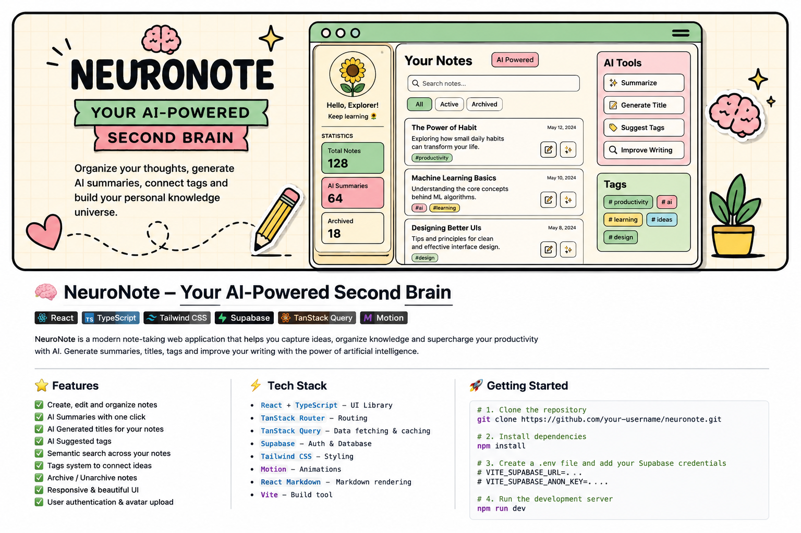

<p align="center">
  
</p>

<h1 align="center">NeuroNote</h1>

<p align="center">
  Your AI-Powered Second Brain
</p>

<p align="center">
  NeuroNote is an AI-powered productivity workspace that transforms notes into an intelligent knowledge system.
</p>

---

<p align="center">
  
</p>

<p align="center">
  
  
  
</p>

---

# Smart Notes

<p>
  
</p>

- Create, edit and delete notes
- Archive and unarchive notes
- Rich markdown rendering
- Sticky productivity layout
- Responsive note cards
- Interactive dashboard workspace

---

# AI Features

<p>
  
</p>

- AI-generated summaries
- AI-generated titles
- AI-powered tag suggestions
- Floating AI recommendation cards
- Interactive AI tools panel
- Modern animated UI interactions

---

# Semantic Search

<p>
  
</p>

- Semantic note search with pgvector
- Embedding-based similarity matching
- Natural language note discovery
- Smart contextual results

### Example Searches

- “camera I never use”
- “frontend portfolio ideas”
- “fitness habits”
- “machine learning concepts”

---

# Tag System

<p>
  
</p>

- Create custom tags
- Attach/remove tags dynamically
- AI-generated tags
- Visual tag organization

---

# Modern UI / UX

<p>
  
</p>

- Motion animations
- Floating tooltips
- Dashboard transitions
- Smooth microinteractions
- Soft notebook aesthetic
- Responsive layout
- Animated workspace experience

---

# Tech Stack

## Frontend

<p>
  
</p>

- React
- TypeScript
- Vite
- Tailwind CSS
- TanStack Router
- TanStack Query
- Motion
- React Markdown

---

## Backend

<p>
  
</p>

- Node.js
- Express
- TypeScript
- PostgreSQL
- pgvector
- JWT Authentication
- OpenAI API

---

# AI Capabilities

NeuroNote uses AI to transform notes into contextual knowledge.

### Current AI Features

- Generate summaries automatically
- Improve note titles
- Suggest contextual tags
- Semantic search using embeddings

### Planned AI Features

- AI Chat with Notes
- Global Workspace AI Chat
- Knowledge Graphs
- Context Memory
- Embeddings Explorer
- AI Productivity Assistant

---

# Preview

## Dashboard

- AI-powered workspace
- Sticky note creation panel
- Semantic search
- Animated interface

## AI Tools

- Generate summaries
- Generate titles
- Suggest tags
- Floating recommendation cards

---

# Installation

## Clone Repository

```bash
git clone https://github.com/yamil-pedroso/neuronote.git
